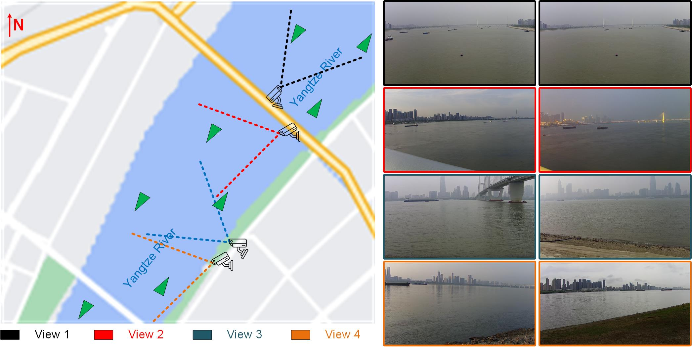

# Video-AIS-Fusion-Empowered-Intelligent-Maritime-Surveillance-in-Inland-Waterways
Video/AIS Fusion-Empowered Intelligent Maritime Surveillance in Inland Waterways__Ocean Engineering

## Multi-View Vessel (MVV) Dataset

The constructed multi-view vessel detection dataset is published on:
https://pan.baidu.com/s/1vfws54AN5WiCgITGOR_hoQ
Pass Code: mipc

## Examples

## Cited

If the MVV Dataset is used please cite it as: Jingxiang Qu, Ryan Wen Liu, Yu Guo, Yuxu Lu, Jianlong Su, Peizheng Li, "Improving maritime traffic surveillance in inland waterways using the robust fusion of AIS and visual data", Ocean Engineering, 2023.

For more dataset about vessel detection the simultaneous data about video and AIS data fusion, please see our newest work: https://github.com/gy65896/FVessel
